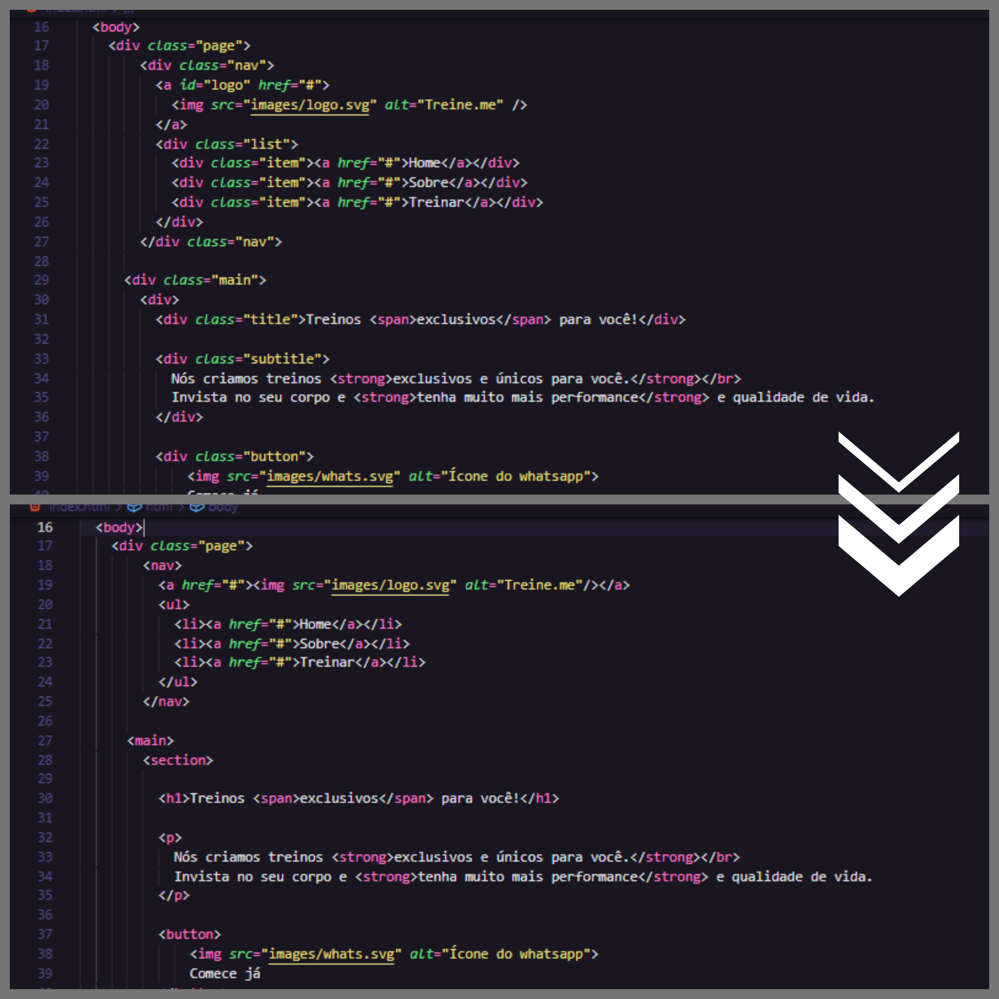

<h1 align="center"> Semântica e acessibilidade </h1>

Este é um projeto de acessibilidade criado durante o curso Explorer de Rocketseat.

  

## 🚀 Tecnologias

Esse projeto foi desenvolvido com as seguintes tecnologias:

- HTML 
- CSS
- Figma

## 💻 Projeto

O objetivo do projeto foi a transformação do código de acordo com as recomendações de acessibilidade, sem alterar o layaout da página.

## 🔖 Layout

Você pode visualizar o layout do projeto através [DESSE LINK](https://www.figma.com/file/rkDOHGPwwFtBNqEdHSuQPd/Projeto-02---Explorer?type=design&node-id=0-1&t=N6kuMAMH6cPQtjjs-0). É necessário ter conta no [Figma](https://figma.com) para acessá-lo.

## :memo: Licença

Esse projeto está sob a licença MIT.